这应该是 `Deepin` 下最全的安装 `zsh` 的教程了～ <!--more-->


`Deepin` 令人大赞的一个功能就是它自带的 `terminal` 了，非常好用，不仅主题多样好看，各种快捷使用也很棒，其中的 `shell` 一直用的是自带的，听说 `zsh` 挺好用的，前几天下载下来玩了玩，立马抛弃了原生的 `shell`，接下来就谈谈怎么在 `Deepin` 下安装和配置 `zsh`

## 1. 安装 zsh

[参考文章](http://www.520code.net/index.php/archives/40/)

直接打开 `terminal`，然后输入以下命令即可

```shell
sudo apt-get install zsh
```

然后安装 `oh-my-zsh`

```shell
 sh -c "$(wget https://raw.github.com/robbyrussell/oh-my-zsh/master/tools/install.sh -O -)"
```

安装过程中会提示是否将 `zsh` 做为你的默认 `shell`，确定即可，如果安装完毕默认的还是原生 `shell`，那么可以使用下面命令将 `zsh` 设置为默认 `shell`

```shell
chsh -s $(which zsh)
```

检测

```shell
zsh --version                                                                
zsh 5.3.1 (x86_64-debian-linux-gnu)
```

```shell
echo $SHELL                                                                   
/usr/bin/zsh
```

我安装完毕后的效果如下（改了主题）

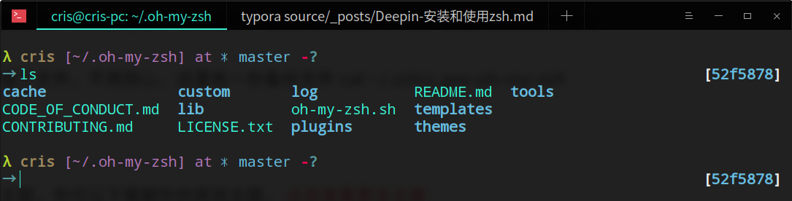


## 2. 修改主题

`oh-my-zsh` 有很多好玩的主题，默认是在 `～/.oh-my-zsh/themes` 目录下，已经预先配置了很多自带主题，如果想要自己下载额外的主题，[可以参考](https://github.com/robbyrussell/oh-my-zsh/wiki/External-themes)

个人下载了以下三个主题，感觉比较有意思

**第一个主题 Pi**

[参考主页](https://github.com/tobyjamesthomas/pi)

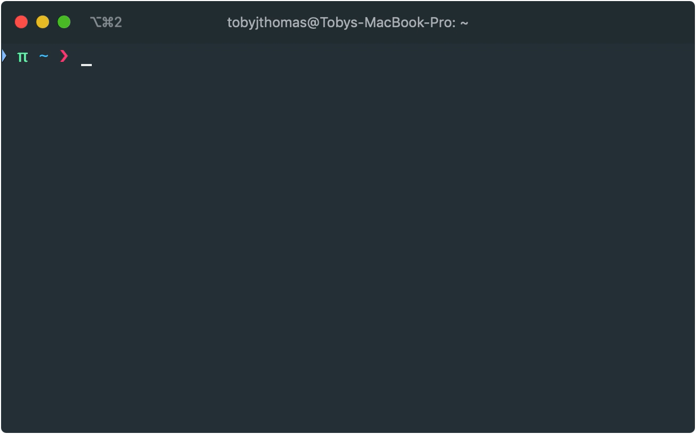

安装的时候，注意`$ZSH_CUSTOM` 是你zsh安装目录，默认是 `~/.oh-my-zsh`，实际上我的并不是

```shell
λ cris [~] → echo $ZSH_CUSTOM
/home/cris/.oh-my-zsh/custom
```

所以建议使用下面命令安装

```shell
wget -O  ~/.oh-my-zsh/themes/pi.zsh-theme https://raw.githubusercontent.com/tobyjamesthomas/pi/master/pi.zsh-theme
```

安装完毕后，直接修改 `～/.zshrc` 文件即可

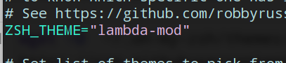

改为 `pi` 即可


**第二个主题 punctual-zsh-theme**

[参考地址](https://github.com/dannynimmo/punctual-zsh-theme)

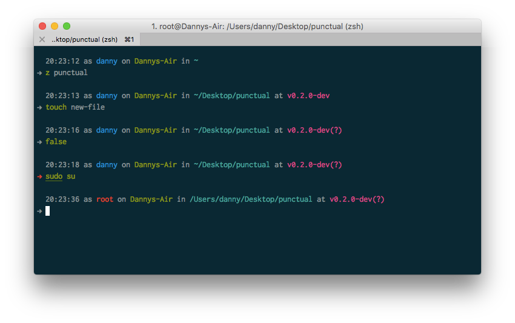

下载命令

```shell
wget -O  ~/.oh-my-zsh/themes/punctual.zsh-theme
https://raw.githubusercontent.com/dannynimmo/punctual-zsh-theme/v0.1.0/punctual.zsh-theme
```

修改同上


**第三个主题 lambda-mod-zsh-theme** 

[参考地址](https://github.com/halfo/lambda-mod-zsh-theme/)

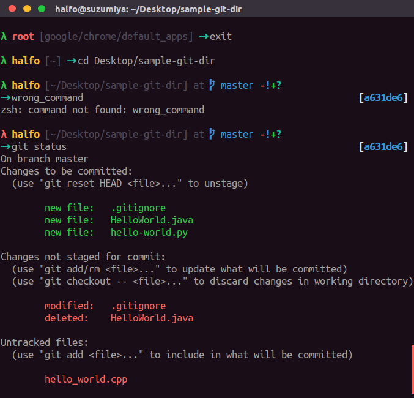


在安装这个主题的时候，遇到了一些麻烦，因为主页并没有提供下载的方式，捣鼓了一会，仿照前面两种主题下载，使用 `raw` 的方式得到主题文件的内容链接

[参考](https://blog.csdn.net/Dontla/article/details/100017358)

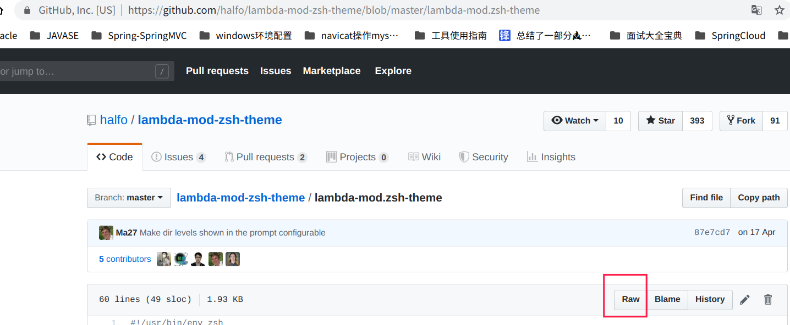


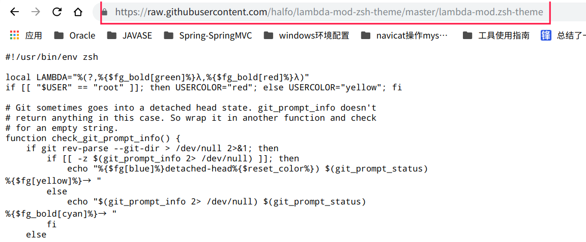

这个链接就和前两种主题的下载链接一模一样了

然后命令如下

```shell
wget -O  ~/.oh-my-zsh/themes/lambda-mod.zsh-theme
https://raw.githubusercontent.com/halfo/lambda-mod-zsh-theme/master/lambda-mod.zsh-theme
```

配置同上


## 3. 别名

之前 `shell` 的别名，我们可以直接拷贝到 `～/.zshrc` 文件里

```shell
λ cris [~] → cat .bash_aliases >> .zshrc
```

然后 `source` 一下 `～/.zshrc` 文件即可，建议给 `~/.zshrc` 文件做一个备份

可以参考一下我常用的别名

```shell
λ cris [~] → cat .bash_aliases          
alias grep='grep --color=auto'
alias l='ls -lh'
alias ll='ls -lh'
alias c='clear'
alias co='code 1>/dev/null 2>&1 &'
alias id='idea 1>/dev/null 2>&1 &'
alias tgz='tar -C /home/cris/software -zxvf'
alias rm='rm -rf'
alias e='exit'
alias gs='git status'
alias ga='git add .'
alias gc='git commit -m'
alias gp='git push'
alias hs='hexo s -g'
alias hc='hexo clean'
alias hd='hexo clean && hexo d -g'
alias hn='hexo new'
alias na='/home/cris/software/navicat121_premium_cs_x64/start_navicat &'
alias ty='function _f(){ typora $1 1>/dev/null 2>&1 &};_f'
alias de='dedit'
alias mkcd='_(){ mkdir $1; cd $1; };_'
```

还有一种方法是直接在 `~/.zshrc` 的最后一行加上 `source ~/.bash_aliases` 即可，两种方式都可以，推荐第二种

## 4. 插件

**zsh-autosuggestions**

下载命令

```shell
git clone https://github.com/zsh-users/zsh-autosuggestions ${ZSH_CUSTOM:-~/.oh-my-zsh/custom}/plugins/zsh-autosuggestions
```

然后 `vim ~/.zshrc` 

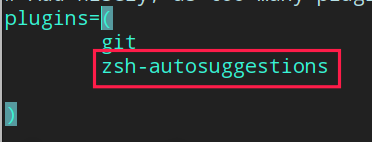

最后 `source ~/.zshrc` 即可

效果如下：

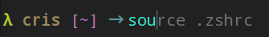

会自动提示输过的命令，`nice`！

建议自动补全的快捷键设置为 ，在 `~/.zshrc` 文件中配置

```
bindkey ',' autosuggest-accept
```

自动补全的时候，按一下 `,` 即可


**autojump**

[参考文章](https://learnku.com/tensorflow/t/5790/ultimate-terminal-zshautojump)

配置完成后，记得 `source ~/.zshrc`

使用方式很简单，先 `cd` 到某个目录，例如 `～/Document` 这个文件夹，那么下次就可以通过 `j Document` 直接进入这个文件夹，或者是 `j do` 甚至 `j d` 直接进入

可以通过 `j --stat` 查看当前状态

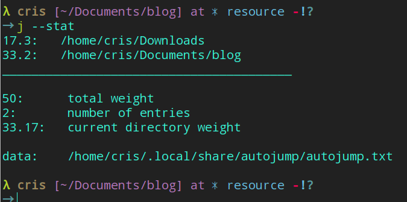


**zsh-syntax-highlighting**

下载命令

```shell
λ cris [~] → git clone https://github.com/zsh-users/zsh-syntax-highlighting.git ${ZSH_CUSTOM:-~/.oh-my-zsh/custom}/plugins/zsh-syntax-highlighting
```

然后在 `~/.zshrc` 中加入插件

```shell
plugins=(
  zsh-syntax-highlighting
)
```

效果就是在你敲击命令的时候，高亮显示

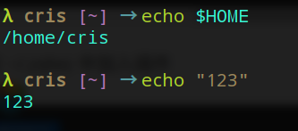


**the fuck**

[官网](https://github.com/nvbn/thefuck)

可以很有效的对之前的错误命令进行自动改进

## 5. 小技巧

**zsh 对其他用户不生效**

[参考博客](https://blog.csdn.net/nangy2514/article/details/92216885)

如果切换到 `root` 用户，发现 `zsh` 没有起作用，首先在我们当前普通用户下，为 `.oh-my-zsh` 赋予权限

```shell
chmod -R 777 .oh-my-zsh
```

然后切换到 `root` 用户，直接拷贝 `.zshrc` 以及 `.bash_aliases` 到 `/root` 目录下

最后在 `/root` 目录下

```shell
source .zshrc 
```

我在切换 `root` 用户的时候，提示我 `鉴定故障`，参考[博客](https://blog.csdn.net/qq_40002311/article/details/88643053)

修改一下 `root` 密码即可

*改进*：每次如果修改 `/home/cris` 的 `.bash_aliases` ，还要同步到 `/root` 目录下，建议直接修改 `/root` 目录下的  `.zshrc` 文件如下

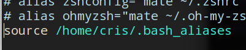


每次登录 `terminal`，`zsh` 会自动提示安全信息

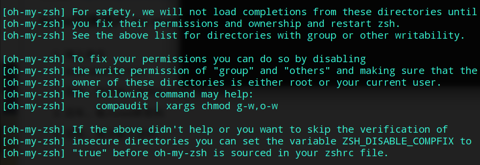

建议跳过不安全目录的验证

修改 `.zshrc` 

```shell
# 放在配置文件最前面
ZSH_DISABLE_COMPFIX="true"
```


**take**

[参考博客](https://segmentfault.com/a/1190000002658335)

直接看看 `take` 命令有什么用

```shell
λ cris [~] → which take
take () {
	mkdir -p $@ && cd ${@:$#}
}
```

**d**

输入 `d` 可以直接看到你最近进入的目录，然后输入对应的数字就可以去到那个目录，比 `autojump` 还快～

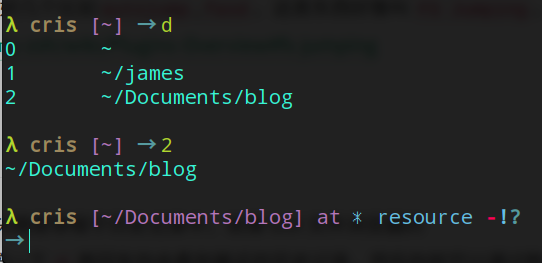


