这应该是网上可以搜索到的最全的在 `Deepin` 下搭建博客的教程了～<!--more-->

## 1. 下载 Node.js


如果根据网上的大部分参考文章，`Deepin` 可以成功安装 `Node.js`，但是无法安装 `npm`，会出现以下错误

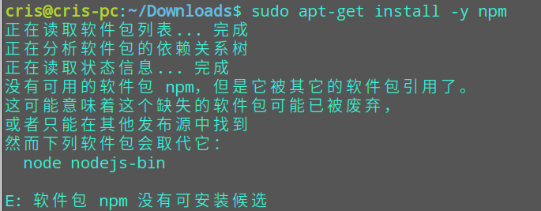


根据这篇[参考文章](http://vksec.com/2019/08/27/78_ubuntu%E4%BD%BF%E7%94%A8npm%E6%8A%A5%E9%94%99%E8%A7%A3%E5%86%B3%E5%8A%9E%E6%B3%95/)

我们直接去 `Node.js` 的[官网](https://nodejs.org/en/)，下载安装包，建议下载 `LTS`（长期支持版本），然后通过如下命令解压到指定的目录

```shell
cris@cris-pc:~/Documents/blog$ tar -xvJf node-v10.16.3-linux-x64.tar.xz -C ../software/
```

如果此时发现输入 `node` 命令无法找到，则需要我们手动建立命令链接如下

```shell
cris@cris-pc:~/Documents/blog$ sudo ln -s /home/cris/software/node-v10.16.3-linux-x64/bin/node  /usr/local/bin/node

cris@cris-pc:~/Documents/blog$ sudo ln -s /home/cris/software/node-v10.16.3-linux-x64/bin/npm /usr/local/bin/npm
```

然后我们可以通过 `node -v` 和 `npm -v` 命令来查看版本信息

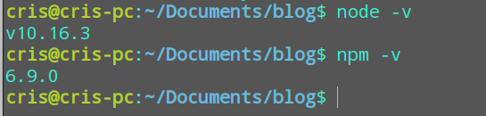

接着我们需要手动的安装 `cnpm`，为了下载速度更快

```shell
sudo npm install -g cnpm --registry=https://registry.npm.taobao.org
```

然后等待安装完成即可

如果输入 `cnpm` 还是无法找到该命令，我们同样可以创建一个链接

```shell
cris@cris-pc:~/Documents/blog$ sudo ln -s /home/cris/software/node-v10.16.3-linux-x64/bin/cnpm  /usr/local/bin/cnpm
```

然后输入 `cnpm -v` 命令可以发现安装成功


## 2. 安装 Git

接着安装 `Git` ，提供版本控制功能

```shell
sudo apt-get install git -y
```

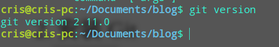

如上表示安装成功

设置自己的 `GitHub` 用户名和邮箱

```shell
cris@cris-pc:~$ git config --global user.email "xxx"
cris@cris-pc:~$ git config --global user.name "xx"
```


## 3. 安装 Hexo

接着我们安装 `Hexo` 这个博客引擎

```shell
cris@cris-pc:~/Documents/blog$ sudo cnpm install -g hexo-cli
```

如果输入 `hexo -v` 还是显示没有命令，我们继续创建命令链接

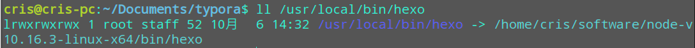

然后输入命令，出现以下界面表示 `Hexo` 安装成功

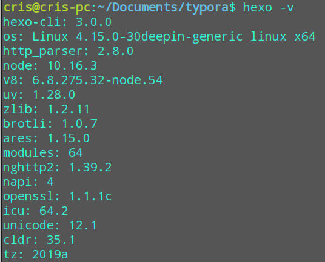

建立一个空的文件夹，`blog` 目录，然后进入 `blog` 目录

使用以下命令初始化我们的博客

```shell
cris@cris-pc:~/Documents/blog$ sudo hexo init
```

然后我们可以发现 `blog` 目录下多了很多文件

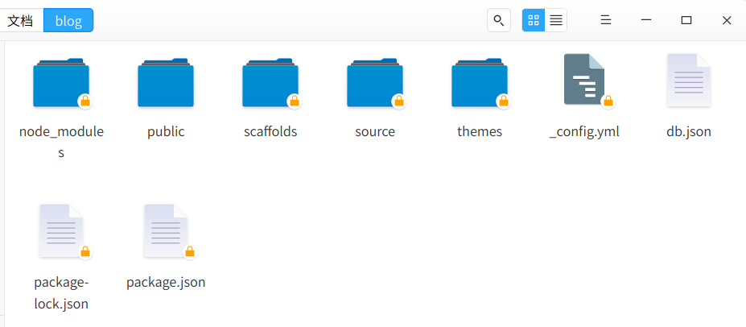


测验 `Hexo` 启动，输入以下命令即可

```shell
cris@cris-pc:~/Documents/blog$ hexo s
```

然后在浏览器输入 http://localhost:4000/ ，出现以下界面表示博客本地搭建成功

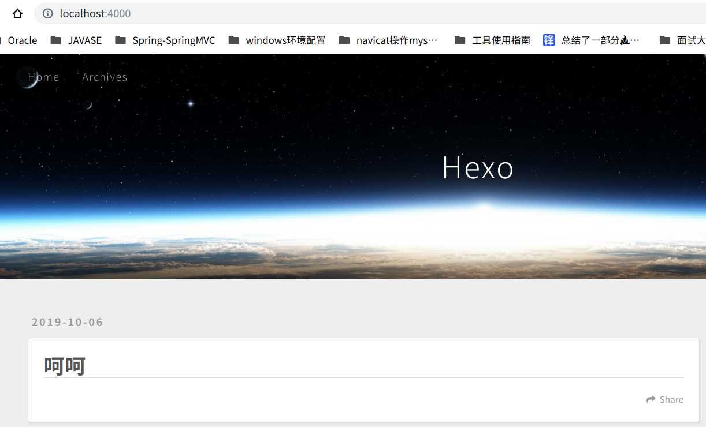


可以通过 `hexo n 博客名`  来生成对应的博客，如下

```shell
cris@cris-pc:~/Documents/blog$ hexo n 我们
```

进入到专门写博客的文件夹

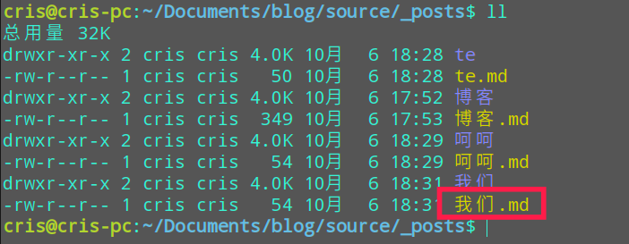

发现 `Hexo` 自动生成了后缀名为 `.md` 的博客文件

然后退回 `blog` 目录，执行以下命令

```shell
hexo g
hexo s
```

重新打开 http://localhost:4000/ ，可以发现一篇名为 `我们` 的新博客又生成了～

如果想要生成博客的同时，对应生成同名的文件夹，可以修改 `blog` 目录下的 `_config.yml`

```yaml
# post_asset_folder: false
post_asset_folder: true
```


## 4. 部署到 GitHub 服务器

进入我们的 `GitHub` 账号，创建一个仓库

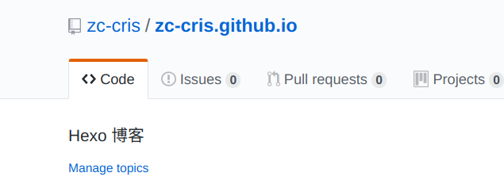

然后在 `blog` 目录下安装一个远程部署插件

```shell
cris@cris-pc:~/Documents/blog$ sudo cnpm install --save hexo-deployer-git
```

紧接着修改配置文件

```shell
cris@cris-pc:~/Documents/blog$ sudo vim _config.yml
```

添加内容如下

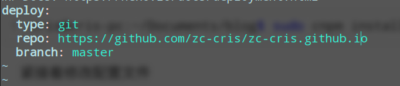

保存退出

然后直接使用 `hexo d` 命令部署即可

```shell
cris@cris-pc:~/Documents/blog$ sudo hexo d
```


然后输入我们的仓库名，出现以下界面表示部署成功

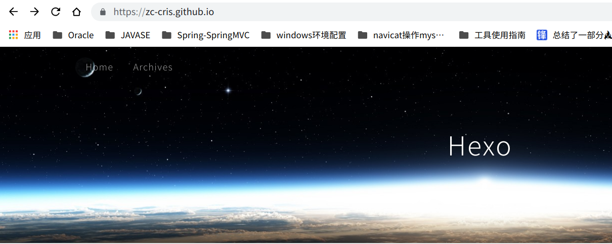


## 5. 使用 Git 分支保存 Hexo 博客源码到 GitHub

因为我们的博客配置文件和 `.md` 源文件最终都是不会被发布到 `GitHub` 的远程仓库，如果我们换电脑或者当前电脑出现问题，那么就得重头再来配置博客环境，十分麻烦，所以这里我们参考[这篇博客](http://www.yangbing.club/2019/06/29/save-hexo-source-post-with-git-branch/)，利用 `GitHub` 的分支来保存我们的博客配置文件和 `.md` 源文件

根据参考博客，我们在 `GitHub` 远程仓库创建另外一个分支 `resource`，并且将其设置为默认分支

但是再将本地博客目录和远程仓库关联的时候，即执行以下命令，你会发现报错了～～～

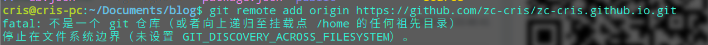

这是因为我们的本地博客目录还不是一个 `git` 仓库，所以需要初始化

```shell
cris@cris-pc:~/Documents/blog$ git init
已初始化空的 Git 仓库于 /home/cris/Documents/blog/.git/
```

然后和我们的远程仓库关联起来

```shell
cris@cris-pc:~/Documents/blog$ git remote add origin https://github.com/zc-cris/zc-cris.github.io.git
```

此时我们处在默认的本地 `master` 分支上

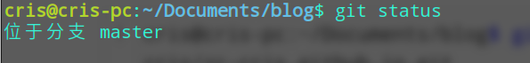

**注意：**

此时我们本地的博客目录在初始化成为 `git` 仓库之前是有内容的，但是这些内容我们需要提交到本地的 `master` 分支上（这和传统的先初始化本地 `git` 仓库，然后在分支上写内容是相反的）

执行以下命令

```shell
cris@cris-pc:~/Documents/blog$ git add .
cris@cris-pc:~/Documents/blog$ git commit -m 'hexo resource'
```

然后发现本地 `master` 分支都保存了我们之前的所有内容

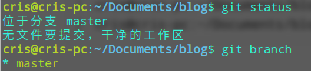

建议从本地的 `master` 分支新建一个本地 `resource` 分支，和我们远程仓库的 `resource` 分支对应起来

```shell
cris@cris-pc:~/Documents/blog$ git checkout b resource
```

查看当前的本地分支

```shell
cris@cris-pc:~/Documents/blog$ git branch 
  master
* resource
```

发现我们正处于本地的 `resource` 分支

如果我们此时就想和远程仓库的 `resource` 分支关联

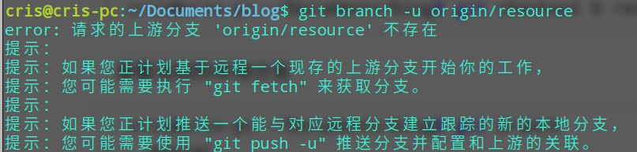

因为我们还没有远程仓库的分支信息，所以需要从远程仓库获取 `resource` 分支的信息

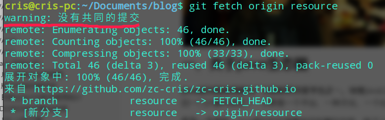

一定要注意 `warning` 信息，我们的远程仓库的 `resource` 分支和我们本地仓库的 `resource` 分支是没有一点关联的现在！

可以查看当前的本地所有分支信息

```shell
cris@cris-pc:~/Documents/blog$ git branch -a
  master
* resource
  remotes/origin/resource
```

然后我们需要设置本地的 `resource` 分支和远程的 `resource` 分支（`remotes/origin/resource`）关联，[参考博客](https://cloud.tencent.com/developer/article/1423150)

```shell
cris@cris-pc:~/Documents/blog$ git branch -u origin/resource
分支 resource 设置为跟踪来自 origin 的远程分支 resource。
```

验证

```shell
cris@cris-pc:~/Documents/blog$ git branch -vv
  master   85b4421 hexo resource
* resource 85b4421 [origin/resource：领先 1，落后 2] hexo resource
```

如果我们此时使用 `git status` 命令，会发现

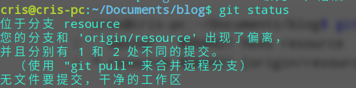

为什么会这样呢？

> 因为我们远程仓库的 `resource` 分支其实是来自远程仓库的 `master` 分支，而此时远程仓库的 `master` 分支内容都是由我们第一次的 `hexo d` 命令推送到远程仓库自动创建的（推送过去的都是通过 `hexo g` 命令处理后的静态资源文件）
>
> 而本地的 `resource` 分支来自于本地的 `master` 分支，而我们使用 `git init` 命令初始化以后，生成了一些新的文件，以及我们的`hexo` 配置文件和 `.md` 文件统一通过 `git add .` 这个命令保存到默认的 `master` 分支，所以本地的 `resource` 分支和远程的 `resource` 分支没有任何相交的地方，并且提交的版本号也没有任何重叠的地方，虽然我们逻辑上可以把这两个分支关联在一起，但是要注意实际上这两个分支可以看做是不同的分支

所以如果我们要推送本地的 `resource` 分支要远程仓库的 `resource` 分支，就会报错！

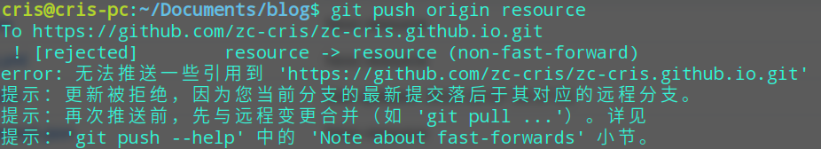


解决方式很简单，合并当前本地的 `resource` 分支和从远程仓库拉取下来的 `resource` 分支即可，但是如果我们使用 `merge` 命令，[参考博客](https://www.cnblogs.com/Yemilice/p/6217201.html)

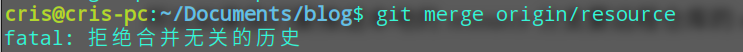

十分恼火！参考[这篇博客](https://blog.csdn.net/u012300744/article/details/80264807)

我们使用如下命令，强行合并

```shell
cris@cris-pc:~/Documents/blog$ git merge origin/resource --allow-unrelated-histories
```

我们会进入一个文件，填写 `merge` 信息，参照上面的博客保存退出即可开始如下合并

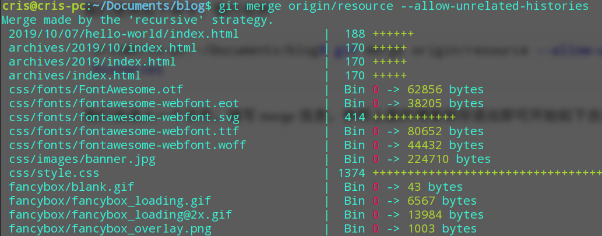


然后我们查看分支信息

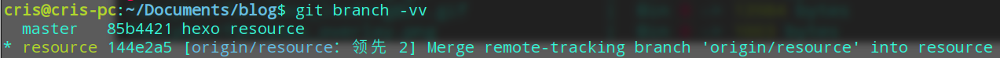

发现合并成功～

直接使用 git push 推到远程仓库的 `resource` 分支即可

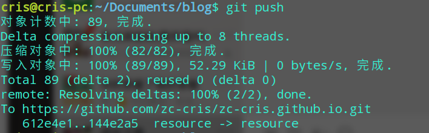

可以通过远程仓库验证

这是 `master` 分支

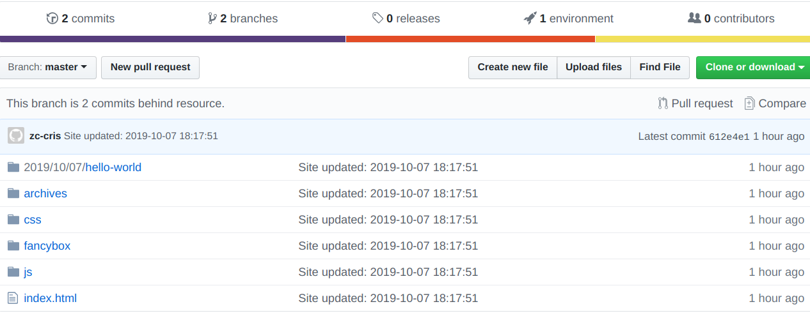


这是 `resource` 分支

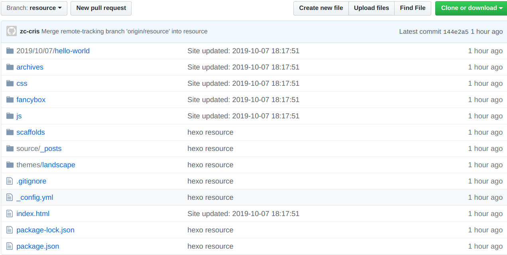


那么我们可以通过本地的博客目录修改博客配置文件，写博客，这些文件都可以通过 `git` 推送到远程的 `resource` 分支上，后续更换电脑或者我们当前电脑除了问题都不用怕了 O(∩_∩)O~

而我们发布到博客的静态资源则是通过 `hexo d` 这个命令自动推送到远程仓库的 `master` 分支，对外展示

通过一个远程仓库的 `master` 分支和 `resource` 分支实现了博客发布和源文件保存两个功能！

> 这个流程花了我大概一天的时间，参考的第一篇博客给了我灵感，但是写的并不好，一些坑都没说出来，导致我又花了很多时间去解决，去解释
>
> 庆幸的是，我对 git 的使用和理解又加深了好多 O(∩_∩)O


**ps：如果在 resource 分支下，无法通过 hexo d 命令推送博客文章，出现如下错误**

```shell
cris@cris-pc:~/Documents/blog$ hexo d
ERROR Deployer not found: git
```

那么在 `resource` 这个分支下重新安装 `hexo-deployer-git` 这个插件即可

```shell
cris@cris-pc:~/Documents/blog$ npm install hexo-deployer-git --save
```

也就是说，我们可以在本地`resource` 分支下，通过执行 `hexo d` 发布博客到自己的网站（推送博客到远程仓库的 `master` 分支），也可以通过 `git push` 推送最新的配置到远程仓库的 `resource` 分支

## 6. 配置 yilia 主题

[以下配置全程参考博客](https://tding.top/archives/9a232bbe.html)

下载完毕 `yilia` 主题后，需要手动设置生效

```shell
cris@cris-pc:~/Documents/blog$ de _config.yml
```

`blog` 是我们的本地博客目录，`de` 是我设置的 `deepin` 别名，在 `~/.bash_aliases` 里写入即可，通过 `de` 这个别名调用 `deepin` 自带的编辑器

```shell
alias de='dedit'
```

修改如下

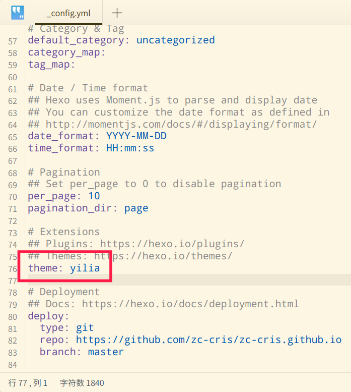

我们可以通过以下命令验证

```shell
cris@cris-pc:~/Documents/blog$ hexo s -g
```

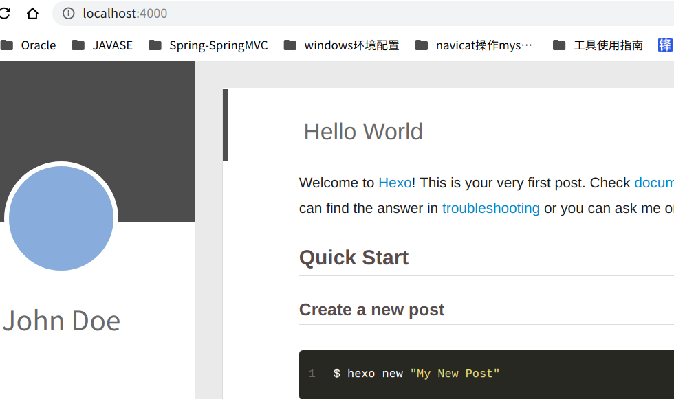


然后推送到远程仓库

```shell
cris@cris-pc:~/Documents/blog$ hexo d
```

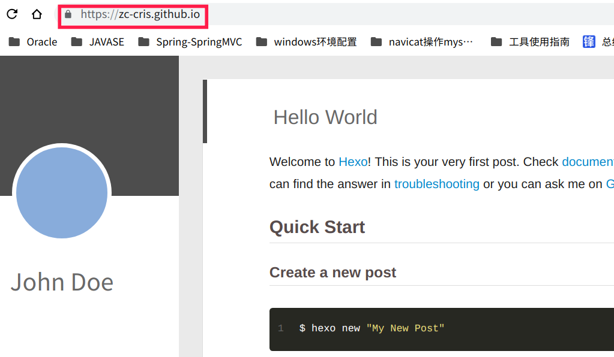

无论是本地还是远程仓库，都修改成功！

**ps：记得推送最新的 resource 分支哦！**

```shell
cris@cris-pc:~/Documents/blog$ git branch 
  master
* resource
cris@cris-pc:~/Documents/blog$ git status
位于分支 resource
您的分支与上游分支 'origin/resource' 一致。
尚未暂存以备提交的变更：
  （使用 "git add <文件>..." 更新要提交的内容）
  （使用 "git checkout -- <文件>..." 丢弃工作区的改动）

	修改：     _config.yml

未跟踪的文件:
  （使用 "git add <文件>..." 以包含要提交的内容）

	themes/yilia/

修改尚未加入提交（使用 "git add" 和/或 "git commit -a"）
cris@cris-pc:~/Documents/blog$ git add .
cris@cris-pc:~/Documents/blog$ git status 
位于分支 resource
您的分支与上游分支 'origin/resource' 一致。
要提交的变更：
  （使用 "git reset HEAD <文件>..." 以取消暂存）

	修改：     _config.yml
	新文件：   themes/yilia

cris@cris-pc:~/Documents/blog$ git commit -m 'add yilia theme'
[resource 49c1ea5] add yilia theme
 2 files changed, 2 insertions(+), 1 deletion(-)
 create mode 160000 themes/yilia
cris@cris-pc:~/Documents/blog$ git push 
对象计数中: 4, 完成.
Delta compression using up to 8 threads.
压缩对象中: 100% (4/4), 完成.
写入对象中: 100% (4/4), 390 bytes | 0 bytes/s, 完成.
Total 4 (delta 2), reused 0 (delta 0)
remote: Resolving deltas: 100% (2/2), completed with 2 local objects.
To https://github.com/zc-cris/zc-cris.github.io.git
   144e2a5..49c1ea5  resource -> resource
cris@cris-pc:~/Documents/blog$ 
```

然后我们验证远程仓库的 `resource` 分支上同样有了 `yilia` 的主题

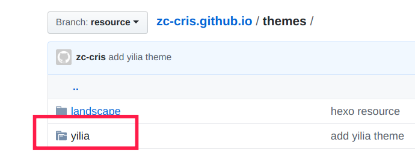


接下来就是按照参考博客一点点配置即可，有几个坑我这里都写出来了

### 6.1 设置权限

如果在操作本地的博客目录时，总是要求 `root` 权限，建议将本地博客目录的权限修改为当前普通用户可以写

```shell
cris@cris-pc:~/Documents$ sudo chmod -R o+w blog/
```

或者修改为 `sudo chmod -R 777 blog/` 也可以，但是不推荐，甚至可以赋予当前普通用户 `root` 权限，仍然不推荐


### 6.2 GitHub 免密

如果使用 `hexo d` 或者 `git push` 老是要求输入 `git` 账号和密码，可以通过以下方式一次性解决

网上大部分是通过 `ssh` 秘钥这种方式实现免密

我们还可以通过 `http` 这种方式，如下

在 `~/` 目录下生成一个  `.git-credentials` 文件，然后在这个文件中输入以下内容

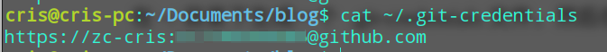

`zc-cris`为自己的 `GitHub` 用户名，马赛克部分就是自己的 `GitHub` 密码，然后执行以下命令

```shell
git config --global credential.helper store
```

即可，这个命令会给 `～/.gitconfig` 文件生成以下内容，用于保存我们的 `GitHub` 用户名和密码

```java
[credential]
	helper = store
```


### 6.3 爬坑细节

- 涉及到 `hexo` 的命令，一般都是在博客主目录，也就是我这里的 `blog` 目录下，例如 `hexo g`，`hexo s` 命令等

- `blog` 目录下有 `_config.yml` 文件，`yilia` 目录下同样有 `_config.yml` 文件，配置的时候千万不要搞混了～

- 修改配置的时候，能粘贴就不要自己手敲，只需要关注粘贴对地方以及自己需要改的小部分配置即可（例如自己的 `GitHub` 地址，自己的头像图片等等）

- 注意根据原博主的配置，我们新建博文的时候，也就是 `.md` 文件的时候，`.md` 文件最上面的 `front` 代码块可以按自己需要修改

    ```html
    ---
    
    title: HTML入门笔记
    
    copyright: true
    date: 2018-11-23 21:07:15
    
    toc: true
    tags: [HTML,前端]
    categories: [前端,HTML]
    ---
    ```

- 在设置头像和图标的时候，头像指的是你的首页自己的头像，图标指的是你的网站标签前面的那个小图标

    示意图如下：

    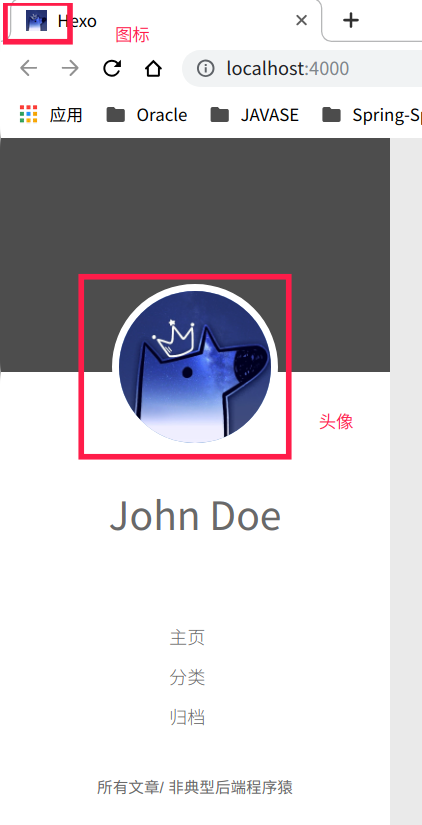

    

推荐使用这个[网站](https://www.favicon-generator.org/)生成你的小图标，建议使用 `32*32` 大小的图标

- 评论部分，`Hexo-Yilia` 代码块行号显示错乱问题，`Hexo` 增加谷歌统计，添加相册 这几部分我没有做，比较麻烦，也感觉没有必要

- 安装 `hexo-wordcount` 的时候，原博主的命令有误，需要使用以下命令（在 `blog` 目录下）

    ```shell
    npm i install hexo-wordcount --save
    ```

- 博客主页修改成自己的名字以及修改网页标签的`title`（修改 `blog` 目录下的 `_config.yml`）

    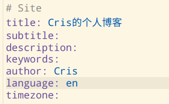

    然后直接输入以下命令，同时 `generate` 生成 和 `start` 启动

    ```shell
    cris@cris-pc:~/Documents/blog$ hexo s -g
    ```

    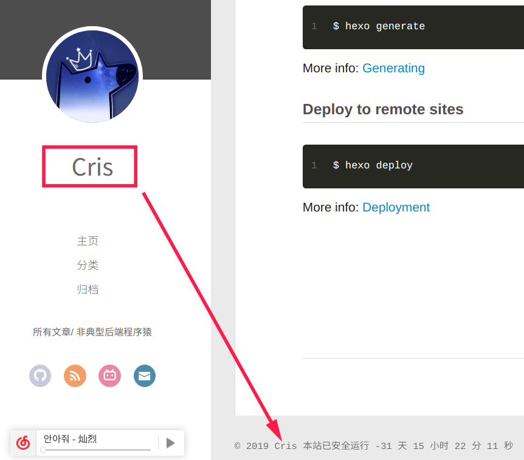

鼠标移动到网页的标签上，就会自动显示你的 `title`

- 在修改自己博客的 `url` 地址的时候（11.4）,一定要修改成自己博客的地址，而不是远程仓库的地址，否则添加 `sitemap` 那一步怎么都无法成功​​ ╮(╯▽╰)╭
- 建议每完成一个大章节的操作后，就通过 git 保存一下，然后 `hexo s -g` 命令启动查看一下效果，否则一口气做到后面，出现错误就完蛋了 /(ㄒoㄒ)/~~
- 有时候出现修改了配置但是没有起作用的话，可以先使用 `hexo clean` 命令，再使用 `hexo s -g` 命令


### 6.4 关于图片无法显示的情况解决

如果根据原博主博客一路做下来，基本配置都没有问题了，但是还有一个最严重的问题，那就是我们往 `.md` 文件插入图片后，通过 `hexo s -g` 命令生成的博客是无法查看图片的

所以我们还需要下载一个插件

```shell
cris@cris-pc:~/Documents/blog$ npm install hexo-asset-image --save
```

然后使用 `hexo clean` 清理一下缓存，再使用 `hexo s -g` 命令即可

之前写博客，都是使用的图床工具，现在搭建好了自己的博客后，就可以直接舍弃图床工具，直接将图片复制粘贴到 `.md` 文件即可，我这里使用 `Typora` 来编写博客

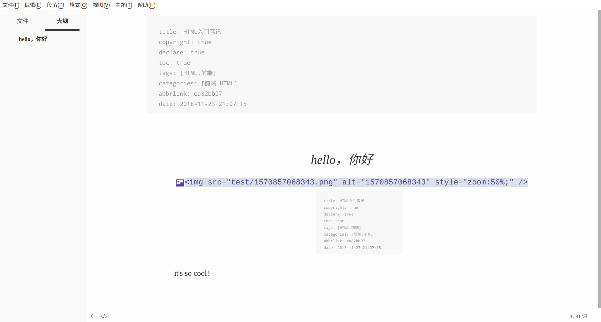

然后 `hexo s -g` 命令生成对应的博客

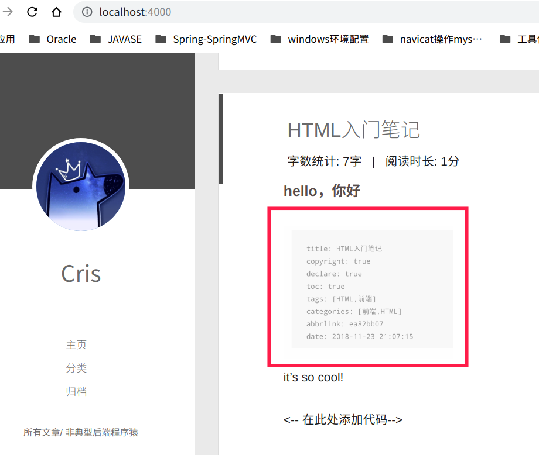

点击博客，进入到博客页同样可以显示图片

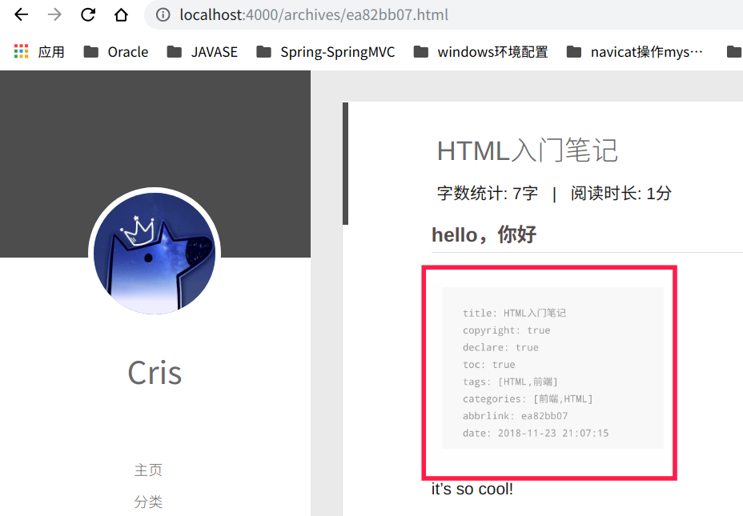

点击图片一样有放大效果


### 6.5 所有的配置完成后

记得推送完成后的配置信息

```shell
cris@cris-pc:~/Documents/blog$ git add .
cris@cris-pc:~/Documents/blog$ git commit -m'update setting files'
[resource e92c2dd] update setting files
 8 files changed, 612 insertions(+), 3 deletions(-)
 create mode 100644 source/_posts/test.md
 create mode 100644 source/_posts/test/1570857068343.png
 create mode 100644 source/_posts/test2.md
 create mode 100644 source/_posts/test2/1570858176121.png
cris@cris-pc:~/Documents/blog$ git push
对象计数中: 14, 完成.
Delta compression using up to 8 threads.
压缩对象中: 100% (12/12), 完成.
写入对象中: 100% (14/14), 40.75 KiB | 0 bytes/s, 完成.
Total 14 (delta 5), reused 0 (delta 0)
remote: Resolving deltas: 100% (5/5), completed with 5 local objects.
To https://github.com/zc-cris/zc-cris.github.io.git
   49cee66..e92c2dd  resource -> resource
```

本地显示无误后，发布博客

```shell
cris@cris-pc:~/Documents/blog$ hexo d
```

查看我们的博客地址

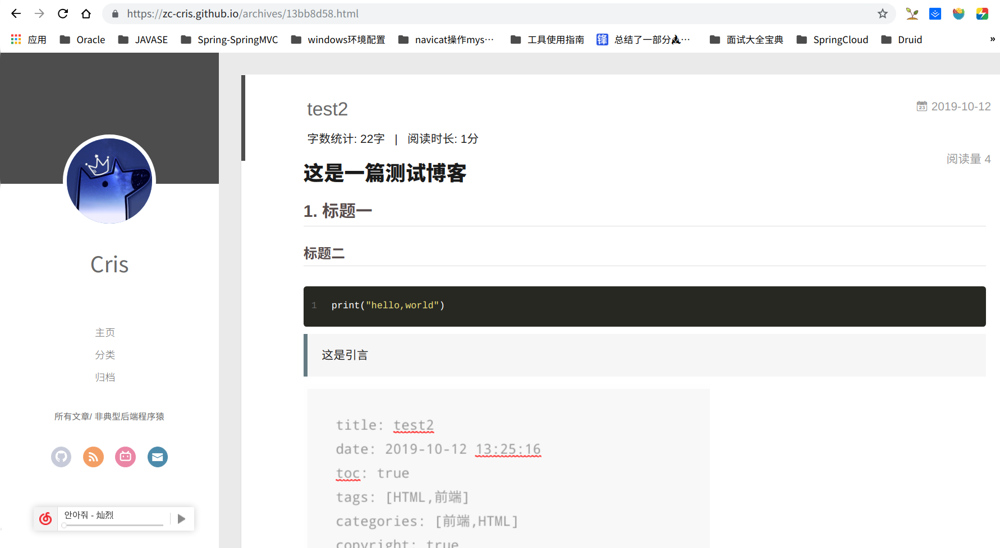

well done！^_^


### 6.6 写博客的步骤总结

1. 在 `blog` 目录下执行`hexo n "myBlog"`，在 `source/_post` 文件夹下生成一个 `myBlog.md`的文件以及同名文件夹
2. 使用 `Typora` 编辑`myBlog.md`，书写自己的博客内容，如果有图片直接插入即可（`Typora` 会将图片复制到同名文件夹下面），写完之后建议导出为 `PDF` 做个备份
3. 执行 `hexo g`生成静态页面；执行 `hexo s` 启动本地服务器预览效果（可以直接 `hexo s -g`）；执行 `hexo d` 将文章部署到`GitHub`实现真正的网络博客；如果修改了配置文件，记得执行 6.5 小节的命令哦～

不需要图床，简单方便，还可以使用 `Typora` 这么好用的 `Markdown` 工具，几个命令发布博客，几个命令随时保存博客配置文件，还有比这更爽的事吗？(*^__^*) 嘻嘻……


## 7. yilia 主题优化（持续更新）

### 7.1 显示博客前几行

默认情况下，博客主页的博客会全部显示完，而实际上我们的主页只需要显示每篇博客的前几行即可，在你写 `md` 文章的时候，可以在内容中加上 `<!--more-->`，这样首页和列表页展示的文章内容就是 `<!--more-->` 之前的文字，而之后的内容就不会在首页显示了

> 进入`theme`目录，打开`yilia`目录下的`_config.yml`文件
>
> 将 `excerpt_link：`之后的`more`单词换成空格
>

*小技巧：可以在首页显示我们每篇博客的顶部大图*

### 7.2 自动 front 模板

当我们通过 `hexo new 博客名` 的命令创建一篇博客的时候，我们会发现博客前面的 `front` 代码模块是固定的

```yaml
---
title: {{ title }}
date: {{ date }}
tags:
---
```

那么每次写博客，我们还要手动去写分类，写 `tag`，实在太麻烦，其实可以通过修改模板的方式来让 `Hexo` 自动为我们生成想要的 `front` 代码，默认是根据 `scaffolds/post.md` 来生成的，所以我们直接修改这个 `post.md` 文件即可

```yaml
---
title: {{ title }}
date: {{ date }}

copyright: true
toc: true
declare: true
tags:
 - 
 - 
categories:
 - 技术文
 - 
---
```

然后我们可以新建一篇博客试试

```shell
hexo new "test"
```

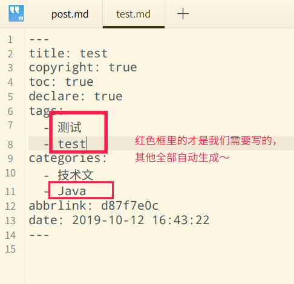

本地生成并启动

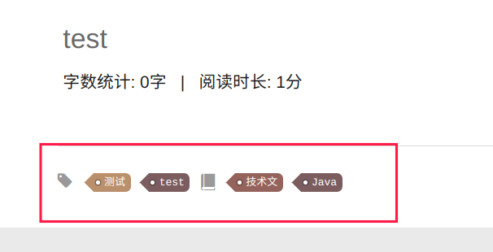

并且进入 `test` 博客正文还发现自动生成了版权声明信息，实在是太方便啦(⊙o⊙)

### 7.3 优化首页链接

我们可以在首页的右下角添加自己想要添加的链接或者图片

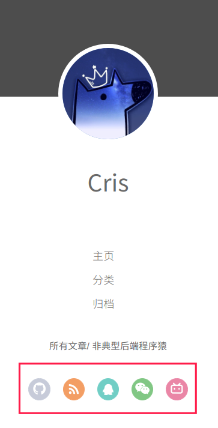

添加方式直接修改 `yilia` 目录下的 `_config.yml` 文件即可

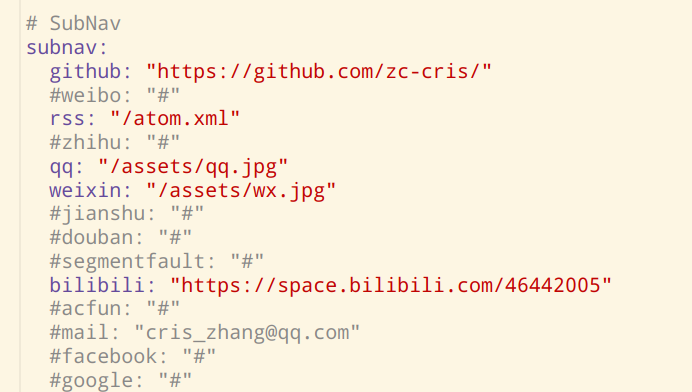

`微信`和 `qq` 图片直接放在 `blog/themes/yilia/source/assets` 目录下即可

然后重新部署启动即可

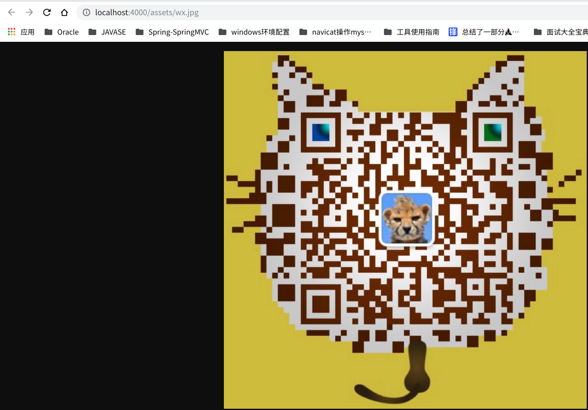


### 7.4 添加博客置顶功能

[参考博客](https://www.jianshu.com/p/a0afac70afc8)

注意 top 后的数字，越小越会排在首页顶部

改进：我们把 top 这个属性写入默认模板

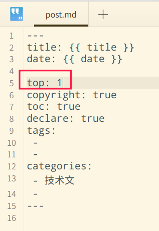

默认为1即可，那么我们每次新建的博客都会置顶