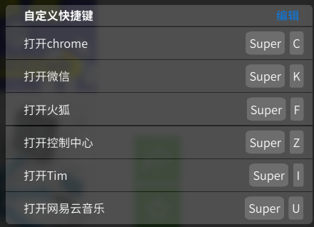

提高效率最好的方式之一：就是熟练使用快捷键！<!--more-->

一直以来都很喜欢使用键盘，鼠标能不用就不用，毕竟当你愉快的敲打键盘的时候，还要突然去摸一下鼠标，感觉是件很违和的事情，尤其是在敲代码或者写作的时候，那种感觉，(*@ο@*) em... 就好像你游戏玩的正嗨皮的时候一个`call`突然打过来，简直不能忍～

所以我喜欢去搜索，总结很多的快捷键，然后把个人感觉有用的提取出来，每天练习练习，就熟了，效率也就慢慢的越来越高，通过快捷键的使用，你会发现越来越了解正在使用的软件，也会发现很多好玩的功能，废话不多说，下面就是我总结的比较有用，或者比较有意思的 `Deepin` 系统快捷键

## 1. 自定义系统快捷键

首先在 `Deepin` 下，你是可以很方便的自定义系统快捷键的，[参考文章](https://jingyan.baidu.com/article/a681b0de502ed63b18434614.html)

最主要的用途还是在于快速打开软件，我的设置如下：

那么打开软件的时候，就可以直接通过键盘呼出了，比自己还要`shafufu` 的切换到桌面，移动鼠标，点击图标快了还是1s左右，对于三秒真男人的我来说，这已经很快了O(∩_∩)O哈哈~

## 2. 好用的系统快捷键

`Deepin` 给我感觉比较好的一点就是，它的很多系统快捷键都是和 `Windows` 通用的，对于已经很习惯 `Windows` 快捷键的我来说，几乎是无缝对接，十分爽快

- 系统应用快捷键

| 快捷键             | 作用                                           |
| ------------------ | ---------------------------------------------- |
| super（也就是win） | 打开启动器                                     |
| super+z            | 打开控制中心                                   |
| super+e            | 打开文件管理器                                 |
| ctrl+alt+t         | 打开终端                                       |
| alt+f2             | 打开雷神模式的终端（有点好玩，关闭使用alt+f4） |
| ctrl+alt+a         | 截屏                                           |
| printScreen        | 全屏截图                                       |
| ctrl+alt+r         | 录屏                                           |
| ctrl+alt+delete    | 显示关机界面                                   |
| ctrl+alt+esc       | 显示系统监视界面                               |

- 应用界面快捷键

| 快捷键   | 作用                                   |
| -------- | -------------------------------------- |
| alt+`    | 同应用切换窗口                         |
| alt+tab  | 切换窗口（不能通过方向键切换，不太好） |
| super+d  | 显示桌面                               |
| super+w  | 显示当前工作区所有窗口                 |
| super+上 | 最大化窗口                             |
| super+下 | 恢复原窗口大小                         |
| super+n  | 最小化窗口                             |
| alt+f7   | 移动窗口（需要借助鼠标）               |
| alt+f8   | 改变窗口大小（需要借助鼠标）           |
| alt+f4   | 关闭窗口                               |
| ctrl+w   | 关闭当前窗口标签页                     |
| ctrl+t   | 新打开一个标签页                       |
| ctrl+f   | 搜索                                   |
| ctrl+n   | 又打开一个当前应用的窗口               |
| ctrl+q   | 退出应用                               |

- 工作区

| 快捷键            | 作用                          |
| ----------------- | ----------------------------- |
| super+s           | 管理工作区界面                |
| super+左/右       | 切换到左边/右边工作区         |
| shift+super+左/右 | 将当前窗口移动到左/右边工作区 |

- 其他快捷键

| 快捷键       | 作用         |
| ------------ | ------------ |
| f2           | 重命名       |
| delete       | 删除文件     |
| shift+delete | 永久删除文件 |
| ctrl+shift+n | 新建文件夹   |
| super+l      | 锁屏         |

个人还是很喜欢 `Deepin` 这个`Linux` 桌面发行版，和`Windows` 操作类似，对于轻度办公的人来说，和 `Windows` 使用基本没区别，对于喜欢`Linux` 的同学来说，也很友好，有比较好看的界面和动画，内置的软件也很好用

总之，个人还是很看好 `Deepin` 的发展的，虽然稳定性上还有待提高，作为国产开发的`Linux` 桌面系统，还是很支持的～ 加油↖(^ω^)↗

